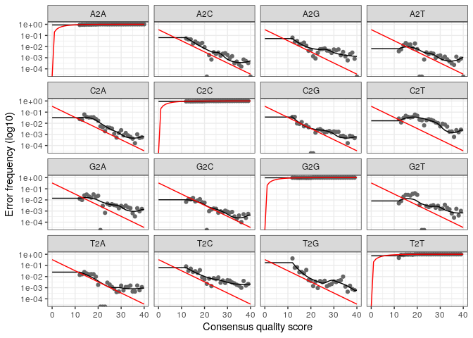

R Notebook
================

Installation dada2

``` r
#Charger et verifier l'installation du package dada2
library(dada2); 
```

    ## Loading required package: Rcpp

``` r
packageVersion("dada2")
```

    ## [1] '1.28.0'

Le Chemin d’acces des fichiers du dossier “MiSeq_SOP”

``` r
#Indiquer le chemin et lister les fichiers de MiSeq_SOP
path <- "~/data_analysis/tutoriel_ADM/MiSeq_SOP" 
list.files(path)
```

    ##  [1] "F3D0_S188_L001_R1_001.fastq"                          
    ##  [2] "F3D0_S188_L001_R2_001.fastq"                          
    ##  [3] "F3D1_S189_L001_R1_001.fastq"                          
    ##  [4] "F3D1_S189_L001_R2_001.fastq"                          
    ##  [5] "F3D141_S207_L001_R1_001.fastq"                        
    ##  [6] "F3D141_S207_L001_R2_001.fastq"                        
    ##  [7] "F3D142_S208_L001_R1_001.fastq"                        
    ##  [8] "F3D142_S208_L001_R2_001.fastq"                        
    ##  [9] "F3D143_S209_L001_R1_001.fastq"                        
    ## [10] "F3D143_S209_L001_R2_001.fastq"                        
    ## [11] "F3D144_S210_L001_R1_001.fastq"                        
    ## [12] "F3D144_S210_L001_R2_001.fastq"                        
    ## [13] "F3D145_S211_L001_R1_001.fastq"                        
    ## [14] "F3D145_S211_L001_R2_001.fastq"                        
    ## [15] "F3D146_S212_L001_R1_001.fastq"                        
    ## [16] "F3D146_S212_L001_R2_001.fastq"                        
    ## [17] "F3D147_S213_L001_R1_001.fastq"                        
    ## [18] "F3D147_S213_L001_R2_001.fastq"                        
    ## [19] "F3D148_S214_L001_R1_001.fastq"                        
    ## [20] "F3D148_S214_L001_R2_001.fastq"                        
    ## [21] "F3D149_S215_L001_R1_001.fastq"                        
    ## [22] "F3D149_S215_L001_R2_001.fastq"                        
    ## [23] "F3D150_S216_L001_R1_001.fastq"                        
    ## [24] "F3D150_S216_L001_R2_001.fastq"                        
    ## [25] "F3D2_S190_L001_R1_001.fastq"                          
    ## [26] "F3D2_S190_L001_R2_001.fastq"                          
    ## [27] "F3D3_S191_L001_R1_001.fastq"                          
    ## [28] "F3D3_S191_L001_R2_001.fastq"                          
    ## [29] "F3D5_S193_L001_R1_001.fastq"                          
    ## [30] "F3D5_S193_L001_R2_001.fastq"                          
    ## [31] "F3D6_S194_L001_R1_001.fastq"                          
    ## [32] "F3D6_S194_L001_R2_001.fastq"                          
    ## [33] "F3D7_S195_L001_R1_001.fastq"                          
    ## [34] "F3D7_S195_L001_R2_001.fastq"                          
    ## [35] "F3D8_S196_L001_R1_001.fastq"                          
    ## [36] "F3D8_S196_L001_R2_001.fastq"                          
    ## [37] "F3D9_S197_L001_R1_001.fastq"                          
    ## [38] "F3D9_S197_L001_R2_001.fastq"                          
    ## [39] "filtered"                                             
    ## [40] "HMP_MOCK.v35.fasta"                                   
    ## [41] "Mock_S280_L001_R1_001.fastq"                          
    ## [42] "Mock_S280_L001_R2_001.fastq"                          
    ## [43] "mouse.dpw.metadata"                                   
    ## [44] "mouse.time.design"                                    
    ## [45] "silva_nr99_v138.2_toGenus_trainset.fa.gz?download=1"  
    ## [46] "silva_nr99_v138.2_toSpecies_trainset.fa.gz?download=1"
    ## [47] "SILVA_SSU_r138_2_2024.RData"                          
    ## [48] "silva_v138.2_assignSpecies.fa.gz?download=1"          
    ## [49] "stability.batch"                                      
    ## [50] "stability.files"

Récupération des fichiers FASTQ et extraction des noms

``` r
# Les fichiers de lecture fastq Forward F et  reverse R ont respectivement un format : NOM ECHANTILLON_R1_001.fastq et  NOM ECHANTILLON_R2_001.fastq
fnFs <- sort(list.files(path, pattern="_R1_001.fastq", full.names = TRUE))
fnRs <- sort(list.files(path, pattern="_R2_001.fastq", full.names = TRUE))
# extraire les noms d’échantillons à partir de fichiers FASTQ dont les noms suivent le format: SAMPLENAME_XXX.fastq
sample.names <- sapply(strsplit(basename(fnFs), "_"), `[`, 1)
```

Inspecter les profils de qualité des forwards(fnFS\[1:2\])

``` r
##visualiser la qualité des lectures (reads) pour le forward
plotQualityProfile(fnFs[1:2])
```

<!-- -->

Inspecter les profils de qualité des reverses(fnRs\[1:2\])

``` r
##visualiser la qualité des lectures (reads) pour le reverse
plotQualityProfile(fnRs[1:2])
```

<!-- -->

Créer un dossier contenant les fichiers bruts et les noms des fichiers
filtrés

``` r
filtFs <- file.path(path, "filtered", paste0(sample.names, "_F_filt.fastq.gz"))
filtRs <- file.path(path, "filtered", paste0(sample.names, "_R_filt.fastq.gz"))
names(filtFs) <- sample.names
names(filtRs) <- sample.names
```

Filtrer et Rogner

``` r
#Filtrage et trimming 
out <- filterAndTrim(fnFs, filtFs, fnRs, filtRs, truncLen=c(240,160),
              maxN=0, maxEE=c(2,2), truncQ=2, rm.phix=TRUE,
              compress=TRUE, multithread=FALSE) # On Windows set multithread=FALSE
head(out)
```

    ##                               reads.in reads.out
    ## F3D0_S188_L001_R1_001.fastq       7793      7113
    ## F3D1_S189_L001_R1_001.fastq       5869      5299
    ## F3D141_S207_L001_R1_001.fastq     5958      5463
    ## F3D142_S208_L001_R1_001.fastq     3183      2914
    ## F3D143_S209_L001_R1_001.fastq     3178      2941
    ## F3D144_S210_L001_R1_001.fastq     4827      4312

Interprétation : -reads.in = nombre de lectures (reads) originales dans
chaque fichier FASTQ avant filtrage -reads.out = nombre de lectures
conservées après filtrage de qualité

Apprendre les taux d’erreurs

``` r
#Apprendre le taux d'erreurs pour les forwards
errF <- learnErrors(filtFs, multithread=TRUE)
```

    ## 33514080 total bases in 139642 reads from 20 samples will be used for learning the error rates.

• 3514080 total bases = nombre total de nucléotides  
• 139642 reads = nombre total de lectures prises pour estimer les taux
d’erreur • 20 échantillons = nombre d’échantillons analysé

``` r
#Apprendre le taux d'erreurs pour les reverses
errR <- learnErrors(filtRs, multithread=TRUE)
```

    ## 22342720 total bases in 139642 reads from 20 samples will be used for learning the error rates.

• 22342720 total bases = nombre total de nucléotides  
• 139642 reads = nombre total de lectures prises pour estimer les taux
d’erreur • 20 échantillons = nombre d’échantillons analysé

Visualiser les taux d’erreur estimés

``` r
#visualiser les taux d'erreur estimés
plotErrors(errF, nominalQ=TRUE)
```

    ## Warning: Transformation introduced infinite values in continuous y-axis
    ## Transformation introduced infinite values in continuous y-axis

<!-- -->

Inférence d’échantillon avec l’algorithme Dada2

``` r
#les séquences uniques détectées dans les fichiers forwards
dadaFs <- dada(filtFs, err=errF, multithread=TRUE)
```

    ## Sample 1 - 7113 reads in 1979 unique sequences.
    ## Sample 2 - 5299 reads in 1639 unique sequences.
    ## Sample 3 - 5463 reads in 1477 unique sequences.
    ## Sample 4 - 2914 reads in 904 unique sequences.
    ## Sample 5 - 2941 reads in 939 unique sequences.
    ## Sample 6 - 4312 reads in 1267 unique sequences.
    ## Sample 7 - 6741 reads in 1756 unique sequences.
    ## Sample 8 - 4560 reads in 1438 unique sequences.
    ## Sample 9 - 15637 reads in 3590 unique sequences.
    ## Sample 10 - 11413 reads in 2762 unique sequences.
    ## Sample 11 - 12017 reads in 3021 unique sequences.
    ## Sample 12 - 5032 reads in 1566 unique sequences.
    ## Sample 13 - 18075 reads in 3707 unique sequences.
    ## Sample 14 - 6250 reads in 1479 unique sequences.
    ## Sample 15 - 4052 reads in 1195 unique sequences.
    ## Sample 16 - 7369 reads in 1832 unique sequences.
    ## Sample 17 - 4765 reads in 1183 unique sequences.
    ## Sample 18 - 4871 reads in 1382 unique sequences.
    ## Sample 19 - 6504 reads in 1709 unique sequences.
    ## Sample 20 - 4314 reads in 897 unique sequences.

Interprétation:

• Sample 1 → échantillon 1 • 7113 reads → nombre de lectures filtrées et
utilisées pour cet échantillon (après avoir filtrer et rogner) • 1979
sequences uniques → nombre de séquences uniques (ASVs) identifiées par
DADA2 après correction des erreurs Idem pour le reste

les séquences uniques détectées dans les fichiers reverses

``` r
dadaRs <- dada(filtRs, err=errR, multithread=TRUE)
```

    ## Sample 1 - 7113 reads in 1660 unique sequences.
    ## Sample 2 - 5299 reads in 1349 unique sequences.
    ## Sample 3 - 5463 reads in 1335 unique sequences.
    ## Sample 4 - 2914 reads in 853 unique sequences.
    ## Sample 5 - 2941 reads in 880 unique sequences.
    ## Sample 6 - 4312 reads in 1286 unique sequences.
    ## Sample 7 - 6741 reads in 1803 unique sequences.
    ## Sample 8 - 4560 reads in 1265 unique sequences.
    ## Sample 9 - 15637 reads in 3414 unique sequences.
    ## Sample 10 - 11413 reads in 2522 unique sequences.
    ## Sample 11 - 12017 reads in 2771 unique sequences.
    ## Sample 12 - 5032 reads in 1415 unique sequences.
    ## Sample 13 - 18075 reads in 3290 unique sequences.
    ## Sample 14 - 6250 reads in 1390 unique sequences.
    ## Sample 15 - 4052 reads in 1134 unique sequences.
    ## Sample 16 - 7369 reads in 1635 unique sequences.
    ## Sample 17 - 4765 reads in 1084 unique sequences.
    ## Sample 18 - 4871 reads in 1161 unique sequences.
    ## Sample 19 - 6504 reads in 1502 unique sequences.
    ## Sample 20 - 4314 reads in 732 unique sequences.

Idem pour les reverses

``` r
#Regarder les ASVs détectées dans le premier échantillon 
dadaFs[[1]]
```

    ## dada-class: object describing DADA2 denoising results
    ## 128 sequence variants were inferred from 1979 input unique sequences.
    ## Key parameters: OMEGA_A = 1e-40, OMEGA_C = 1e-40, BAND_SIZE = 16

Sur les 1979 séquences uniques filtrées pour l’échantillon 1, 128 ASVs
uniques ont été identifiées par dada2

Fusionner des lectures appariées

``` r
#Assemblage des reads forwards et reverses
mergers <- mergePairs(dadaFs, filtFs, dadaRs, filtRs, verbose=TRUE)
```

    ## 6540 paired-reads (in 107 unique pairings) successfully merged out of 6891 (in 197 pairings) input.

    ## 5028 paired-reads (in 101 unique pairings) successfully merged out of 5190 (in 157 pairings) input.

    ## 4986 paired-reads (in 81 unique pairings) successfully merged out of 5267 (in 166 pairings) input.

    ## 2595 paired-reads (in 52 unique pairings) successfully merged out of 2754 (in 108 pairings) input.

    ## 2553 paired-reads (in 60 unique pairings) successfully merged out of 2785 (in 119 pairings) input.

    ## 3646 paired-reads (in 55 unique pairings) successfully merged out of 4109 (in 157 pairings) input.

    ## 6079 paired-reads (in 81 unique pairings) successfully merged out of 6514 (in 198 pairings) input.

    ## 3968 paired-reads (in 91 unique pairings) successfully merged out of 4388 (in 187 pairings) input.

    ## 14233 paired-reads (in 143 unique pairings) successfully merged out of 15355 (in 352 pairings) input.

    ## 10528 paired-reads (in 120 unique pairings) successfully merged out of 11165 (in 278 pairings) input.

    ## 11154 paired-reads (in 137 unique pairings) successfully merged out of 11797 (in 298 pairings) input.

    ## 4349 paired-reads (in 85 unique pairings) successfully merged out of 4802 (in 179 pairings) input.

    ## 17431 paired-reads (in 153 unique pairings) successfully merged out of 17812 (in 272 pairings) input.

    ## 5850 paired-reads (in 81 unique pairings) successfully merged out of 6095 (in 159 pairings) input.

    ## 3716 paired-reads (in 86 unique pairings) successfully merged out of 3894 (in 147 pairings) input.

    ## 6865 paired-reads (in 99 unique pairings) successfully merged out of 7191 (in 187 pairings) input.

    ## 4426 paired-reads (in 67 unique pairings) successfully merged out of 4603 (in 127 pairings) input.

    ## 4576 paired-reads (in 101 unique pairings) successfully merged out of 4739 (in 174 pairings) input.

    ## 6092 paired-reads (in 109 unique pairings) successfully merged out of 6315 (in 173 pairings) input.

    ## 4269 paired-reads (in 20 unique pairings) successfully merged out of 4281 (in 28 pairings) input.

``` r
# Inspecter les résultats de fusion (merger) pour le premier échantillon
head(mergers[[1]])
```

    ##                                                                                                                                                                                                                                                       sequence
    ## 1 TACGGAGGATGCGAGCGTTATCCGGATTTATTGGGTTTAAAGGGTGCGCAGGCGGAAGATCAAGTCAGCGGTAAAATTGAGAGGCTCAACCTCTTCGAGCCGTTGAAACTGGTTTTCTTGAGTGAGCGAGAAGTATGCGGAATGCGTGGTGTAGCGGTGAAATGCATAGATATCACGCAGAACTCCGATTGCGAAGGCAGCATACCGGCGCTCAACTGACGCTCATGCACGAAAGTGTGGGTATCGAACAGG
    ## 2 TACGGAGGATGCGAGCGTTATCCGGATTTATTGGGTTTAAAGGGTGCGTAGGCGGCCTGCCAAGTCAGCGGTAAAATTGCGGGGCTCAACCCCGTACAGCCGTTGAAACTGCCGGGCTCGAGTGGGCGAGAAGTATGCGGAATGCGTGGTGTAGCGGTGAAATGCATAGATATCACGCAGAACCCCGATTGCGAAGGCAGCATACCGGCGCCCTACTGACGCTGAGGCACGAAAGTGCGGGGATCAAACAGG
    ## 3 TACGGAGGATGCGAGCGTTATCCGGATTTATTGGGTTTAAAGGGTGCGTAGGCGGGCTGTTAAGTCAGCGGTCAAATGTCGGGGCTCAACCCCGGCCTGCCGTTGAAACTGGCGGCCTCGAGTGGGCGAGAAGTATGCGGAATGCGTGGTGTAGCGGTGAAATGCATAGATATCACGCAGAACTCCGATTGCGAAGGCAGCATACCGGCGCCCGACTGACGCTGAGGCACGAAAGCGTGGGTATCGAACAGG
    ## 4 TACGGAGGATGCGAGCGTTATCCGGATTTATTGGGTTTAAAGGGTGCGTAGGCGGGCTTTTAAGTCAGCGGTAAAAATTCGGGGCTCAACCCCGTCCGGCCGTTGAAACTGGGGGCCTTGAGTGGGCGAGAAGAAGGCGGAATGCGTGGTGTAGCGGTGAAATGCATAGATATCACGCAGAACCCCGATTGCGAAGGCAGCCTTCCGGCGCCCTACTGACGCTGAGGCACGAAAGTGCGGGGATCGAACAGG
    ## 5 TACGGAGGATGCGAGCGTTATCCGGATTTATTGGGTTTAAAGGGTGCGCAGGCGGACTCTCAAGTCAGCGGTCAAATCGCGGGGCTCAACCCCGTTCCGCCGTTGAAACTGGGAGCCTTGAGTGCGCGAGAAGTAGGCGGAATGCGTGGTGTAGCGGTGAAATGCATAGATATCACGCAGAACTCCGATTGCGAAGGCAGCCTACCGGCGCGCAACTGACGCTCATGCACGAAAGCGTGGGTATCGAACAGG
    ## 6 TACGGAGGATGCGAGCGTTATCCGGATTTATTGGGTTTAAAGGGTGCGTAGGCGGGATGCCAAGTCAGCGGTAAAAAAGCGGTGCTCAACGCCGTCGAGCCGTTGAAACTGGCGTTCTTGAGTGGGCGAGAAGTATGCGGAATGCGTGGTGTAGCGGTGAAATGCATAGATATCACGCAGAACTCCGATTGCGAAGGCAGCATACCGGCGCCCTACTGACGCTGAGGCACGAAAGCGTGGGTATCGAACAGG
    ##   abundance forward reverse nmatch nmismatch nindel prefer accept
    ## 1       579       1       1    148         0      0      1   TRUE
    ## 2       470       2       2    148         0      0      2   TRUE
    ## 3       449       3       4    148         0      0      1   TRUE
    ## 4       430       4       3    148         0      0      2   TRUE
    ## 5       345       5       6    148         0      0      1   TRUE
    ## 6       282       6       5    148         0      0      2   TRUE

Construire une table de séquence

``` r
#Construction de la table ASV
seqtab <- makeSequenceTable(mergers)
dim(seqtab)
```

    ## [1]  20 293

Chaque ligne = un échantillon

Chaque colonne = une ASV unique

La valeur = nombre de lectures (reads) de cette ASV dans l’échantillon

Ici nous avons avec la fonction dim() 20 échantillons et 293 ASVs

La distribution des longueurs des séquences uniques

``` r
# vérifier la distribution des longueurs des séquences uniques
table(nchar(getSequences(seqtab)))
```

    ## 
    ## 251 252 253 254 255 
    ##   1  88 196   6   2

Interprétation:

On observe que :

-1 ASVs fait 251 nucléotides

-88 ASVs font 252 nucléotides

-196 ASVs font 253 nucléotides

-6 ASVs font 254 nucléotides

-2 ASVs font 255 nucléotides

Supprimer les chimères

``` r
seqtab.nochim <- removeBimeraDenovo(seqtab, method="consensus", multithread=TRUE, verbose=TRUE)
```

    ## Identified 61 bimeras out of 293 input sequences.

``` r
dim(seqtab.nochim)
```

    ## [1]  20 232

• 293 = nombre total de séquences d’ASV détectées avant la suppression
des chimères. • 61= séquences chimériques identifiées. • 20 = nombre
d’échantillons • 232 = nombre d’ASV conservées après suppression des
chimères.

Total de lectures restantes après suppression des chimères

``` r
sum(seqtab.nochim)/sum(seqtab)
```

    ## [1] 0.9640374

96 % des lectures ont été conservées et seul 4% des lectures sont des
chimères

Suivi des lectures tout au long du pipeline

``` r
#Suivre les lectures à travers le pipeline
getN <- function(x) sum(getUniques(x))
track <- cbind(out, sapply(dadaFs, getN), sapply(dadaRs, getN), sapply(mergers, getN), rowSums(seqtab.nochim))
# If processing a single sample, remove the sapply calls: e.g. replace sapply(dadaFs, getN) with getN(dadaFs)
colnames(track) <- c("input", "filtered", "denoisedF", "denoisedR", "merged", "nonchim")
rownames(track) <- sample.names
head(track)
```

    ##        input filtered denoisedF denoisedR merged nonchim
    ## F3D0    7793     7113      6976      6979   6540    6528
    ## F3D1    5869     5299      5227      5239   5028    5017
    ## F3D141  5958     5463      5331      5357   4986    4863
    ## F3D142  3183     2914      2799      2830   2595    2521
    ## F3D143  3178     2941      2822      2868   2553    2519
    ## F3D144  4827     4312      4151      4228   3646    3507

Ce tableau nous permet de voir combien de reads sont perdus à chaque
étape et identifier un échantillon avec trop peu de reads ou une perte
excessive. Nous avons conservé la majorité de nos données brutes, et il
n’y a pas de baisse excessive associée à une étape particulière

Attribution d’une taxonomie

``` r
taxa <- assignTaxonomy(seqtab.nochim, "~/data_analysis/tutoriel_ADM/MiSeq_SOP/silva_nr99_v138.2_toGenus_trainset.fa.gz?download=1", multithread=FALSE)
```

Assignation des ASVs

``` r
taxa <- addSpecies(taxa, "~/data_analysis/tutoriel_ADM/MiSeq_SOP/silva_v138.2_assignSpecies.fa.gz?download=1")
```

Affichage de l’assignation taxonomique

``` r
taxa.print <- taxa  # on supprime les noms de ligne (séquences)
rownames(taxa.print) <- NULL
head(taxa.print) # on affiche les premières lignes 
```

    ##      Kingdom    Phylum         Class         Order           Family          
    ## [1,] "Bacteria" "Bacteroidota" "Bacteroidia" "Bacteroidales" "Muribaculaceae"
    ## [2,] "Bacteria" "Bacteroidota" "Bacteroidia" "Bacteroidales" "Muribaculaceae"
    ## [3,] "Bacteria" "Bacteroidota" "Bacteroidia" "Bacteroidales" "Muribaculaceae"
    ## [4,] "Bacteria" "Bacteroidota" "Bacteroidia" "Bacteroidales" "Muribaculaceae"
    ## [5,] "Bacteria" "Bacteroidota" "Bacteroidia" "Bacteroidales" "Bacteroidaceae"
    ## [6,] "Bacteria" "Bacteroidota" "Bacteroidia" "Bacteroidales" "Muribaculaceae"
    ##      Genus         Species
    ## [1,] NA            NA     
    ## [2,] NA            NA     
    ## [3,] NA            NA     
    ## [4,] NA            NA     
    ## [5,] "Bacteroides" NA     
    ## [6,] NA            NA

On observe que les Bacteroidetes sont les plus représentés et figurent
parmi les taxons les plus abondants

Installation du classifeur DECHIPHER

``` r
#charger et verifier le package "DECHIPHER"
library(DECIPHER); packageVersion("DECIPHER")
```

    ## Loading required package: Biostrings

    ## Loading required package: BiocGenerics

    ## 
    ## Attaching package: 'BiocGenerics'

    ## The following objects are masked from 'package:stats':
    ## 
    ##     IQR, mad, sd, var, xtabs

    ## The following objects are masked from 'package:base':
    ## 
    ##     anyDuplicated, aperm, append, as.data.frame, basename, cbind,
    ##     colnames, dirname, do.call, duplicated, eval, evalq, Filter, Find,
    ##     get, grep, grepl, intersect, is.unsorted, lapply, Map, mapply,
    ##     match, mget, order, paste, pmax, pmax.int, pmin, pmin.int,
    ##     Position, rank, rbind, Reduce, rownames, sapply, setdiff, sort,
    ##     table, tapply, union, unique, unsplit, which.max, which.min

    ## Loading required package: S4Vectors

    ## Loading required package: stats4

    ## 
    ## Attaching package: 'S4Vectors'

    ## The following object is masked from 'package:utils':
    ## 
    ##     findMatches

    ## The following objects are masked from 'package:base':
    ## 
    ##     expand.grid, I, unname

    ## Loading required package: IRanges

    ## Loading required package: XVector

    ## Loading required package: GenomeInfoDb

    ## 
    ## Attaching package: 'Biostrings'

    ## The following object is masked from 'package:base':
    ## 
    ##     strsplit

    ## Loading required package: RSQLite

    ## Loading required package: parallel

    ## [1] '2.28.0'

Classification taxonomique avec le classifeur DECHIPHER

``` r
dna <- DNAStringSet(getSequences(seqtab.nochim)) # Create a DNAStringSet from the ASVs
load("~/data_analysis/tutoriel_ADM/MiSeq_SOP/SILVA_SSU_r138_2_2024.RData") #charger la base de données de référence SILVA
ids <- IdTaxa(dna, trainingSet, strand="top", processors=NULL, verbose=FALSE) # use all processors
ranks <- c("domain", "phylum", "class", "order", "family", "genus", "species") # ranks of interest
# Convert the output object of class "Taxa" to a matrix analogous to the output from assignTaxonomy
taxid <- t(sapply(ids, function(x) {
        m <- match(ranks, x$rank)
        taxa <- x$taxon[m]
        taxa[startsWith(taxa, "unclassified_")] <- NA
        taxa
}))
colnames(taxid) <- ranks; rownames(taxid) <- getSequences(seqtab.nochim)
```

Vérifier les ASVs détectées dans l’échantillon Mock

``` r
unqs.mock <- seqtab.nochim["Mock",]
unqs.mock <- sort(unqs.mock[unqs.mock>0], decreasing=TRUE) # Drop ASVs absent in the Mock
cat("DADA2 inferred", length(unqs.mock), "sample sequences present in the Mock community.\n")
```

    ## DADA2 inferred 20 sample sequences present in the Mock community.

DADA2 a identifié exactement 20 ASVs dans ton échantillon de “Mock
community

L’évaluation de la qualité du pipeline DADA2 en utilisant un échantillon
témoin Mock

``` r
mock.ref <- getSequences(file.path(path, "HMP_MOCK.v35.fasta"))
match.ref <- sum(sapply(names(unqs.mock), function(x) any(grepl(x, mock.ref))))
cat("Of those,", sum(match.ref), "were exact matches to the expected reference sequences.\n")
```

    ## Of those, 20 were exact matches to the expected reference sequences.

20 ASVs correspondent exactement aux séquences de référence attendues

Importer Phyloseq

``` r
#charger et verifier le package "phyloseq"
library(phyloseq); packageVersion("phyloseq")
```

    ## 
    ## Attaching package: 'phyloseq'

    ## The following object is masked from 'package:IRanges':
    ## 
    ##     distance

    ## [1] '1.44.0'

Charger le package Biostrings et verfier l’installation de Biostrings

``` r
library(Biostrings); packageVersion("Biostrings")
```

    ## [1] '2.68.1'

Charger le package ggplot2 et verfier l’installation ggplot2

``` r
#Importer ggplot2
library(ggplot2); packageVersion("ggplot2")
```

    ## [1] '3.4.3'

``` r
theme_set(theme_bw())
```

Construire un data.frame pour les échantillons

``` r
samples.out <- rownames(seqtab.nochim)
subject <- sapply(strsplit(samples.out, "D"), `[`, 1)
gender <- substr(subject,1,1)
subject <- substr(subject,2,999)
day <- as.integer(sapply(strsplit(samples.out, "D"), `[`, 2))
samdf <- data.frame(Subject=subject, Gender=gender, Day=day)
samdf$When <- "Early"
samdf$When[samdf$Day>100] <- "Late"
rownames(samdf) <- samples.out
```

créer un objet phyloseq

``` r
ps <- phyloseq(otu_table(seqtab.nochim, taxa_are_rows=FALSE), 
               sample_data(samdf), 
               tax_table(taxa))
ps <- prune_samples(sample_names(ps) != "Mock", ps) # Remove mock sample
```

Préparer les noms des ASVs et à intégrer les séquences dans l’objet
phyloseq

``` r
dna <- Biostrings::DNAStringSet(taxa_names(ps))
names(dna) <- taxa_names(ps)
ps <- merge_phyloseq(ps, dna)
taxa_names(ps) <- paste0("ASV", seq(ntaxa(ps)))
ps
```

    ## phyloseq-class experiment-level object
    ## otu_table()   OTU Table:         [ 232 taxa and 19 samples ]
    ## sample_data() Sample Data:       [ 19 samples by 4 sample variables ]
    ## tax_table()   Taxonomy Table:    [ 232 taxa by 7 taxonomic ranks ]
    ## refseq()      DNAStringSet:      [ 232 reference sequences ]

La diversité alpha

``` r
#Visualiser l'alpha-diversité 
plot_richness(ps, x="Day", measures=c("Shannon", "Simpson"), color="When")
```

    ## Warning in estimate_richness(physeq, split = TRUE, measures = measures): The data you have provided does not have
    ## any singletons. This is highly suspicious. Results of richness
    ## estimates (for example) are probably unreliable, or wrong, if you have already
    ## trimmed low-abundance taxa from the data.
    ## 
    ## We recommended that you find the un-trimmed data and retry.

<!-- -->

Transformer les données pour une analyse beta-diversité et à réaliser
une ordination NMDS basée sur la distance de Bray-Curtis

``` r
ps.prop <- transform_sample_counts(ps, function(otu) otu/sum(otu))
ord.nmds.bray <- ordinate(ps.prop, method="NMDS", distance="bray")
```

    ## Run 0 stress 0.08043117 
    ## Run 1 stress 0.08616061 
    ## Run 2 stress 0.08043117 
    ## ... Procrustes: rmse 5.76934e-06  max resid 1.254237e-05 
    ## ... Similar to previous best
    ## Run 3 stress 0.08076338 
    ## ... Procrustes: rmse 0.01052801  max resid 0.03240613 
    ## Run 4 stress 0.08076341 
    ## ... Procrustes: rmse 0.01058045  max resid 0.03257709 
    ## Run 5 stress 0.08616061 
    ## Run 6 stress 0.08616061 
    ## Run 7 stress 0.1212044 
    ## Run 8 stress 0.08616061 
    ## Run 9 stress 0.08076339 
    ## ... Procrustes: rmse 0.01054098  max resid 0.03244829 
    ## Run 10 stress 0.08076337 
    ## ... Procrustes: rmse 0.01048667  max resid 0.03227137 
    ## Run 11 stress 0.08076339 
    ## ... Procrustes: rmse 0.01054212  max resid 0.03245201 
    ## Run 12 stress 0.08076339 
    ## ... Procrustes: rmse 0.01055348  max resid 0.032489 
    ## Run 13 stress 0.08616061 
    ## Run 14 stress 0.08616061 
    ## Run 15 stress 0.08076339 
    ## ... Procrustes: rmse 0.01054244  max resid 0.0324533 
    ## Run 16 stress 0.09477208 
    ## Run 17 stress 0.08616061 
    ## Run 18 stress 0.08043116 
    ## ... New best solution
    ## ... Procrustes: rmse 2.595789e-06  max resid 7.331704e-06 
    ## ... Similar to previous best
    ## Run 19 stress 0.08616061 
    ## Run 20 stress 0.08076338 
    ## ... Procrustes: rmse 0.01052999  max resid 0.03241193 
    ## *** Best solution repeated 1 times

Visualiser le résultat de l’ordination NMDS basée sur la distance de
Bray-Curtis

``` r
plot_ordination(ps.prop, ord.nmds.bray, color="When", title="Bray NMDS")
```

<!-- -->

Visualiser la composition taxonomique des 20 ASVs les plus abondantes

``` r
top20 <- names(sort(taxa_sums(ps), decreasing=TRUE))[1:20]
ps.top20 <- transform_sample_counts(ps, function(OTU) OTU/sum(OTU))
ps.top20 <- prune_taxa(top20, ps.top20)
plot_bar(ps.top20, x="Day", fill="Family") + facet_wrap(~When, scales="free_x")
```

<!-- -->
